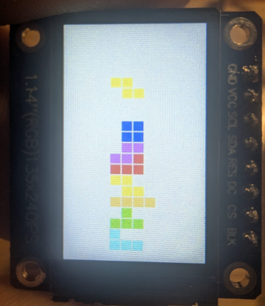

# FPGA Tetris

[](LICENSE)

Collection of FPGA projects for the Tang Nano 9K development board featuring a simplified Tetris game implementation with HDMI and LCD display support.

<div align="center">



</div>

## Projects

| Project | Description |
|---------|-------------|
| **led_blink** | Basic LED blinker example |
| **hdmi_test_working** | HDMI test pattern output (640×480@60Hz) |
| **hdmi_tetris** | Full Tetris game with HDMI output via TMDS encoding |
| **spi_lcd_tetris** | Tetris for SPI LCD displays (ST7789/ILI9341, 128×160) |

## Features

- **Game Logic** - 10×20 board with collision detection and line clearing
- **HDMI Output** - 640×480@60Hz with TMDS encoding
- **SPI LCD Support** - Compatible with ST7789/ILI9341 displays
- **LFSR Random Generation** - Hardware random piece selection
- **Button Controls** - Left/right movement and rotation

## Getting Started

### Prerequisites
- **Tang Nano 9K** development board (Gowin GW1NR-9C)
- **Gowin IDE** V1.9.11.03 or later
- **Gowin Programmer** for FPGA upload
- Optional: HDMI display or SPI LCD module

### Building the Project

1. Clone the repository:
   ```bash
   git clone https://github.com/kfilipekk/FPGA_Tetris.git
   cd FPGA_Tetris
   ```

2. Open the project in Gowin IDE:
   ```bash
   # Navigate to desired project folder
   # Open the .gprj file in Gowin IDE
   ```

3. Build the bitstream:
   ```
   Process → Run All
   ```
   
   Bitstream will be generated in `impl/pnr/`

### Programming the FPGA

Use Gowin Programmer to upload the bitstream:
- **SRAM mode**: Temporary (lost on power cycle) - Good for testing
- **Flash mode**: Permanent (survives power cycle) - Final deployment

Each project folder contains its own README with specific implementation details.

## Hardware Details

- **FPGA**: Gowin GW1NR-LV9QN88PC6/I5
- **Clock**: 27 MHz external oscillator
- **HDMI**: TMDS differential signaling at 25.2 MHz pixel clock
- **LCD**: SPI interface at ~13.5 MHz

<div align="center">

Developed by [kfilipekk](https://github.com/kfilipekk)

</div>
